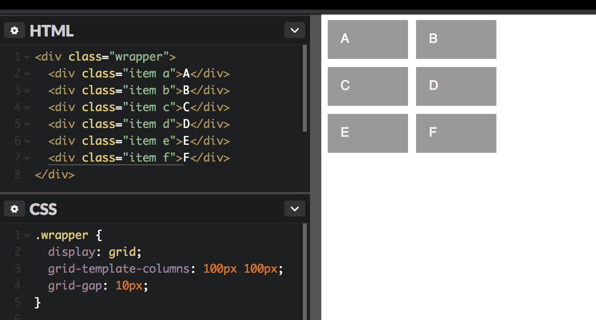
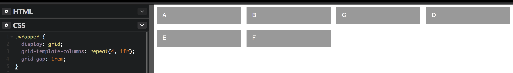
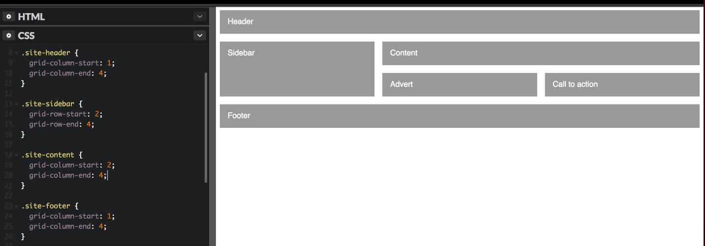
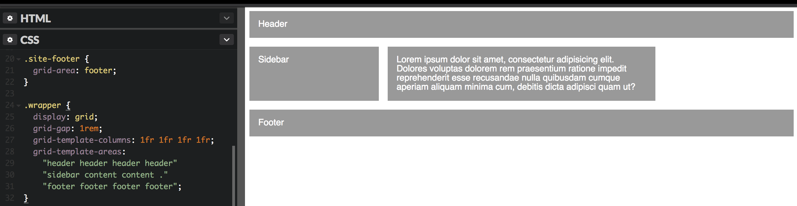
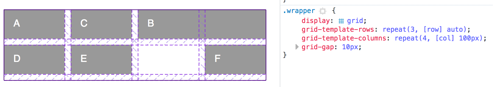
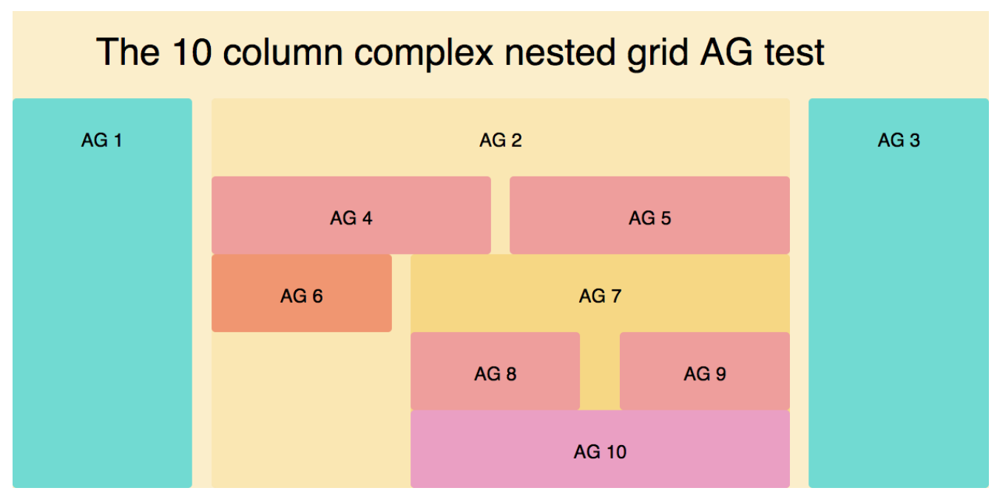
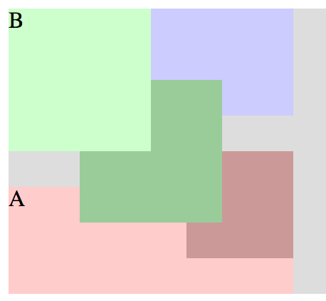
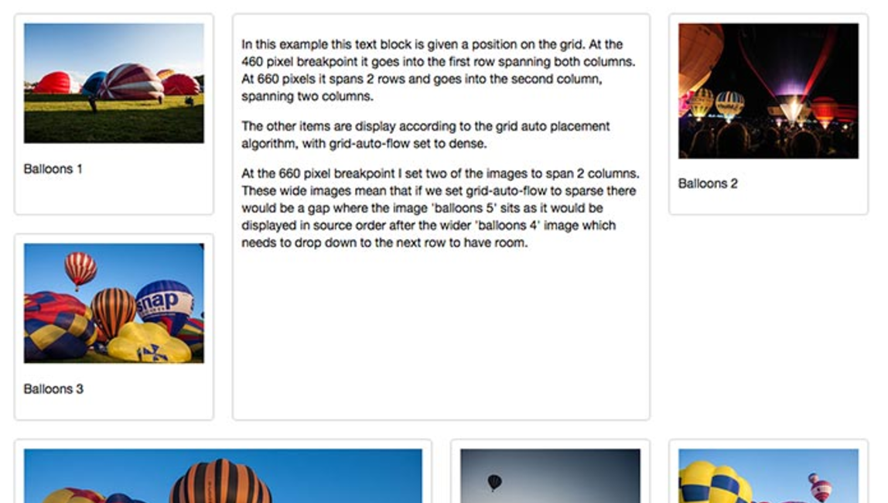
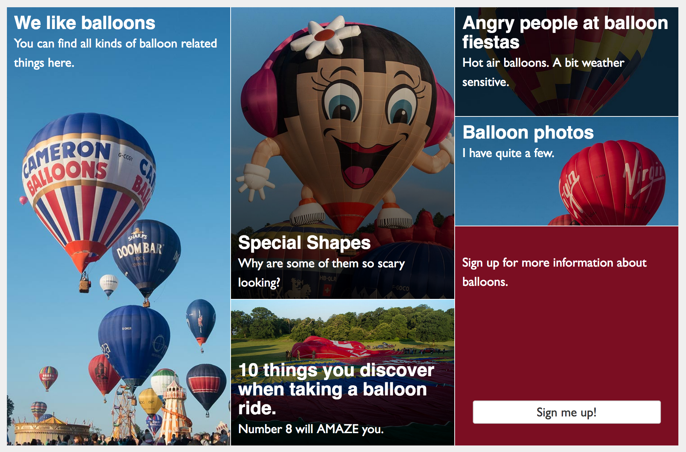

Old IE is taking a back-seat thanks to todays ‘evergreen’ browsers. Hacking layouts with tables and floats are a thing of the past, and flexbox was never intended for full-page structure. (Just look at flexbugs)

There’s a new CSS Spec that’s set to revolutionise the way we build websites. From their overall layout — all the way down to the component level. It’s landing in March 2017 for all modern browsers so it’ll be around before you know it.

](./grid-1.png)_Data from [CanIUse](http://caniuse.com/#search=css%20grid)_

The current support in IE10, IE11, and Edge are referring to the old grid spec that will not be receiving any further updates. Although with Edge the new specification is currently labelled as “Under Consideration” and you can track it’s progress [here](https://developer.microsoft.com/en-us/microsoft-edge/platform/status/gridupdate/?q=grid%20update).

> But it’s so new! It’ll be buggy just like flexbox _😧_

CSS Grid has been in development for 5 years so it’s nothing new, you can place your trust in it. Although I would recommend using it with feature queries to progressively enhance your work. [Rachel Andrew](https://rachelandrew.co.uk/archives/2017/01/03/css-grid-is-coming/) is an advocate that not everything has to look the same, and that browsers and devices can grow into your design.

> # @supports ( display: grid ) {}

## How it’s done

There will be some new CSS to learn, but it’s okay! You can start small and make some pretty smart grid-work. The more complex stuff can be dived into once you’re feeling more comfortable.

This is your starting point, getting a grid: display: grid;

Onto the columns, here’s how you make two columns — each with a width of 100 pixels: grid-template-columns: 100px 100px;

Adding your gutters: grid-gap: 10px;

Okay that’s nice and easy, but the units don’t always have to be pixels. In fact they could be ems, rems, or percentages. You can even use a mixture — having each column using a different unit.

> # But wait, there’s more… a new unit!

The grid spec is introducing the fraction unit; it’s used to denote using a fraction of the available space. For those familiar with flexbox, 1 fraction unit is just like using flex: 1;

So now to make your pixel width columns more flexible, you can change it up to: grid-template-columns: 1fr 1fr;

Writing out these column widths can get boring fast — especially if they’re all the same width. Good thing there’s a new notation called repeat() 🎉

If we now want to increase to a four column width: grid-template-columns: repeat(4, 1fr);

Alternatively, if you wanted to specify a column width of 100 pixels but you’d like as many columns as possible; you can use the keyword auto-fill. This will instruct the grid to use as many 100 pixel columns as possible like so: grid-template-columns: repeat(auto-fill, 100px);

Without going into too much more detail, another function that you’ll likely find useful is minmax(). This allows you to specify a minimum width and a maximum width; which can be super useful at times.

## Some Intro Code on: Grid Placement

Each grid item can be placed at a specified location on any row or column and there are many ways this can be done. Using grid-row-start: 1; and grid-row-end: 2; you instruct the grid-item to start at the beginning of the first row, and end at the start of the second row. You can do the same for columns, and the grid will automatically re-shuffle to accommodate your rules.

Or you can just use the shorthand: grid-row: 1 / 2;

There is an _even_ _shorter_ shorthand that simplifies down to ‘row start / column start / row end / column end’, this is: grid-area: 1 / 1 / 2 / 2;

If you don’t want to specify where the item ends — you can use the span keyword. This snippet would instruct an item to start at the beginning of the second row, and span two rows worth: grid-row: 2 / span 2;

## Some Fancy Code on: Grid Placement

When creating your rows and columns you are able to give them each a name, but I won’t go into that in this blog post. Instead I’ll tell you about naming areas.

If in an example you used grid to layout a page, the grid container could be the wrapper and inside you’ll have: a header, an aside, the main content, and a footer. If you give each of these items a class, you can then name them as grid areas like so: grid-area: header;

This can then be used in your grid container to visually create a layout using: grid-template-areas: "header header header"; This would specify that the ‘header’ area should span 1 row and 3 columns. Each row is denoted by a pair of double quotes, and so creating a basic layout is as easy as:

You might notice the empty space after the main content is denoted by using a period; this means no more fake empty columns or grid offsets! ✨

Although take note that if you were to add any further grid items — named or not — they will automatically fill in the gaps.

This way of defining your structure is so powerful, especially as all of the grid code can be flipped and re-structured by media queries! 🔥

## The Cool Bits

Now that we’ve covered what grid is and how it can be used; I’ll leave you to explore how to use it in more detail by yourself. Instead, I’ll show you some cool examples to highlight where it can be used in your every-day projects.

_FireFox Dev Tools_

Good news for those of you that use FireFox! Currently out in the Developer Edition and Nightly — you can click on a small icon next to your display: grid; in order to visualise your grid. How cool is that?!

](./grid-7.png)_[Responsive Tables](http://codepen.io/rachelandrew/pen/PNwaZe)_

This is an example of a table that uses display: grid; and media queries to easily provide a responsive solution. The code is both clean and elegant, whilst allowing you to use tabular data in your markup. Here’s a link to the [codepen](http://codepen.io/rachelandrew/pen/PNwaZe).

This is an example of a complex grid layout that can be done using the [Susy](http://susy.oddbird.net/) grid architecture. Here it’s being done using the native CSS Grid spec — showing just how powerful it can be! Here’s the codepen for the [Susy example](http://codepen.io/straybugs/pen/MKpgZd). While here’s the reference for the [Grid example](http://gridbyexample.com/examples/page-layout/#layout6).

The grid items can also be affected by z-index, this opens up many opportunities for some cool structures.

This example shows a specifically placed featured piece of content, with the rest of the cards automatically flowing around it.

A very common pattern is a featured header section of a page. Rachel Andrew yet again shows an elegant solution to [building this responsively](http://gridbyexample.com/patterns/hero-image-panel/).

## Signing Off

There’s so much more you can do with grid, this is just an introduction to get you on your feet. For further reading I’d highly recommend the article by [Chris House](http://chris.house/) over on CSS Tricks: [A Complete Guide to Grid](https://css-tricks.com/snippets/css/complete-guide-grid/), and anything by [Rachel Andrew](undefined), especially her [Grid by Example](http://gridbyexample.com/).

For those more interested in general CSS Layout and the design associated with it: definitely check out [Stacy Kvernmo](undefined) and her talk “[The Great State of Design](http://www.slideshare.net/Funstacy/the-great-state-of-design-with-css-grid-layout-and-friends)” from [CSSDAY.io](http://cssday.io/)

If you’ve made it this far then thanks for reading, and if you have any questions then feel free to leave a comment or send me a [tweet](https://twitter.com/ConnorHolyday)!
