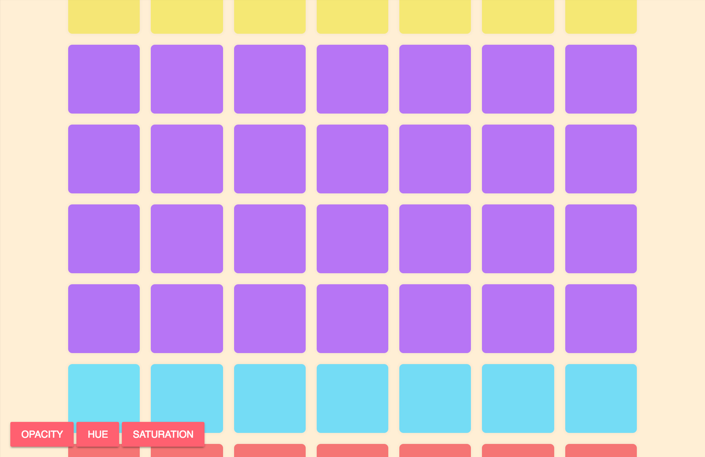

Making their way onto the scene are some new JavaScript API’s known as Observers — and they’re awesome. This isn’t a technical write up, it’s intended to bring some awareness and hopefully make you say “oh that’s funky”.

The Intersection Observer API lets you keep watch on an element and triggers a function every time it crosses the edge of a set boundary. An example of this in action would be observing an image and then as it scrolls into view (or just before) you lazy-load it in.

You’d be right in thinking that we can already do this with scroll-listeners and all sorts of other methods, so what makes this special?

> # It’s fast. Intensely fast.

It tells you how much the element you’re observing has crossed the intersection in a range from 0 to 1. It also works horizontally, that means it’s reporting on both axes at the same time! How cool is that?!

I made the CodePen below to play around with it and it’s ridiculously easy to use. Experiment, have some fun, and as always be sure to check the [MDN](https://developer.mozilla.org/en-US/docs/Web/API/Intersection_Observer_API) page for more detailed information.

<iframe src="https://medium.com/media/2725628eb33bcb87be52f581acdf05c3" frameborder=0></iframe>
