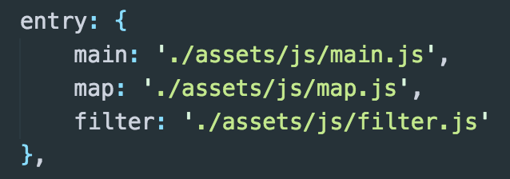

[UPDATE: This is pre Webpack 2, it might be handled differently now]

The other day I was using the Google Maps API for some custom map work; and in order for that to work you are supplied a simple script tag to call it in with a callback that fires when it’s loaded.

This is where I ran into problems with Webpack.

By nature, Webpack is a module bundler, and as such it wraps up all of your assets — serving it up with a nice little bow 🎀. A side-effect of this is that none your functions or variables can be accessed in the global scope. As such the Google Maps callback can’t find my initMap() function…

Okay so I may have spent far too long trawling Google but I have found the pot of gold at the end of the rainbow. Here’s how to get this all sorted:

You can use exports. There are a hundred different ways to do this but my preference is to use the ES6 syntax as best explained in this [MDN article](https://developer.mozilla.org/en/docs/web/javascript/reference/statements/export). However this alone doesn’t expose your functionality, it just makes it known to Webpack. In order to finish this procedure you need to make a small tweak to your Webpack config.

[This section](https://webpack.github.io/docs/library-and-externals.html) of the Webpack documentation explains that you need to name your library, and specify the method you are using for exports. Seeing as I’m using ES6 I can leave out LibraryTarget as it expects this method by default.

Now that this is done, the function I exported can be accessed by calling it via `app.initMap`.

Great, right?! This is where everything broke.

So here’s a little gotcha that I discovered: it turns out that Webpack only exports items from the **_last _**entry point [in your config](https://webpack.github.io/docs/configuration.html#entry).

<iframe src="https://medium.com/media/28db8ed533bb1347941663435572e311" frameborder=0></iframe>

Simple solution though, I’ve got a main index file that pulls in all of the functionality of my app and exports it accordingly. Luckily my project is only a small build so I don’t have any major problems with this. The **_real_** solution would be to use [code-splitting](https://webpack.github.io/docs/code-splitting.html).
