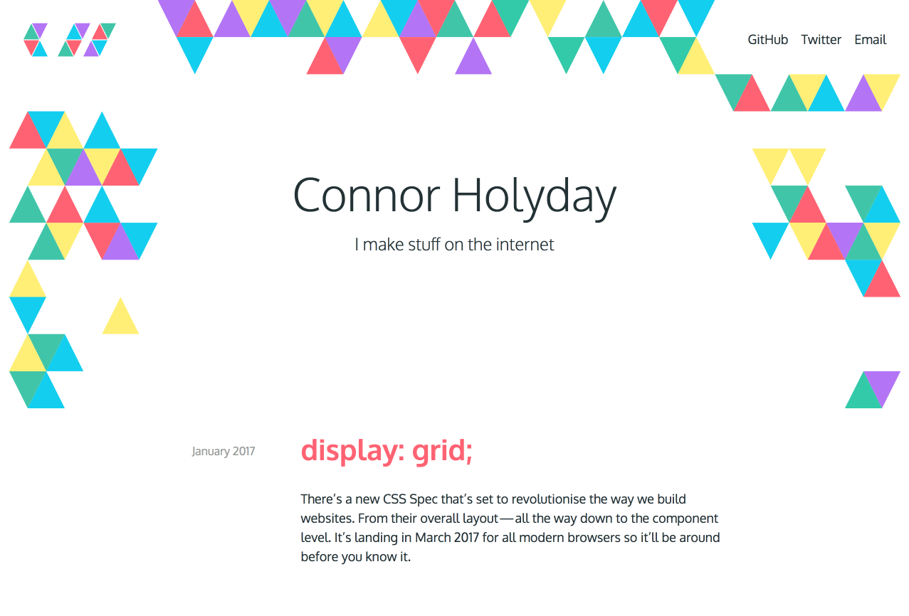

I’ve recently been working on a new edition of my website, some minor updates to give it more oomph. One thing I’ve tried to keep up with is having something fun that people can interact with.

At the moment I’ve got a background of tessellating triangles that all fade in with different colours (from a randomised selection) at different times — and each one disappears under your mouse! This means you can wipe the screen clean! My description does it no justice: [check it out yourself](http://holyday.me).

While I was figuring out what I wanted to build I was checking out [Rogie King](undefined)’s website and I fell in love with the subtle header animation he’s got going on:

](./morph-2.gif)_[http://rog.ie/](http://rog.ie/)_

I thought I’d try to build something similar — or at least attempt to figure out the magic behind it because here’s the twist: it’s not using JavaScript!

**UPDATE: **Here’s a better explanation I’ve found by [Chris Coyier](undefined) from an update to his article [here](https://css-tricks.com/svg-shape-morphing-works/):

> Chrome has started to allow shape morphing through CSS. [Here’s a Pen](http://codepen.io/chriscoyier/pen/NRwANp) that demonstrates that. It’s even more limiting than SMIL though, being limited to the one browser and requiring a path with an identical number of points. Also not hardware accelerated, like all SVG.

Long story short, it’s all run by using CSS to animate the d attribute of an inline SVG. It turns out that in Chrome at the moment you can use keyframes in CSS animations to change the co-ordinates in an SVG, super cool! A bit of a disclaimer though: for the best browser support at the moment it’s better to do this using JavaScript libraries like [svg.js](http://svgjs.com/) or [GreenSock (GSAP)](https://greensock.com/). Here’s a CodePen I’ve spun together that shows what I managed to hack together:

<iframe src="https://medium.com/media/a986a5bc62e13e5a48a5928c13e3ca3c" frameborder=0></iframe>

To get this working I created a shape in Sketch and duplicated it twice to adjust the anchor points so that I had three variations — or three different states of the same shape. The most important thing to note here is that in order for this to work each shape _must_ have the same number of points! If you can’t follow this rule or just can’t seem to get this to work; don’t worry because the JS libraries I mentioned will have your back.

While I didn’t end up using any of this for the website update it was a fun learning experience that’s led me down the path of SVG animation for projects I’ve had since.
