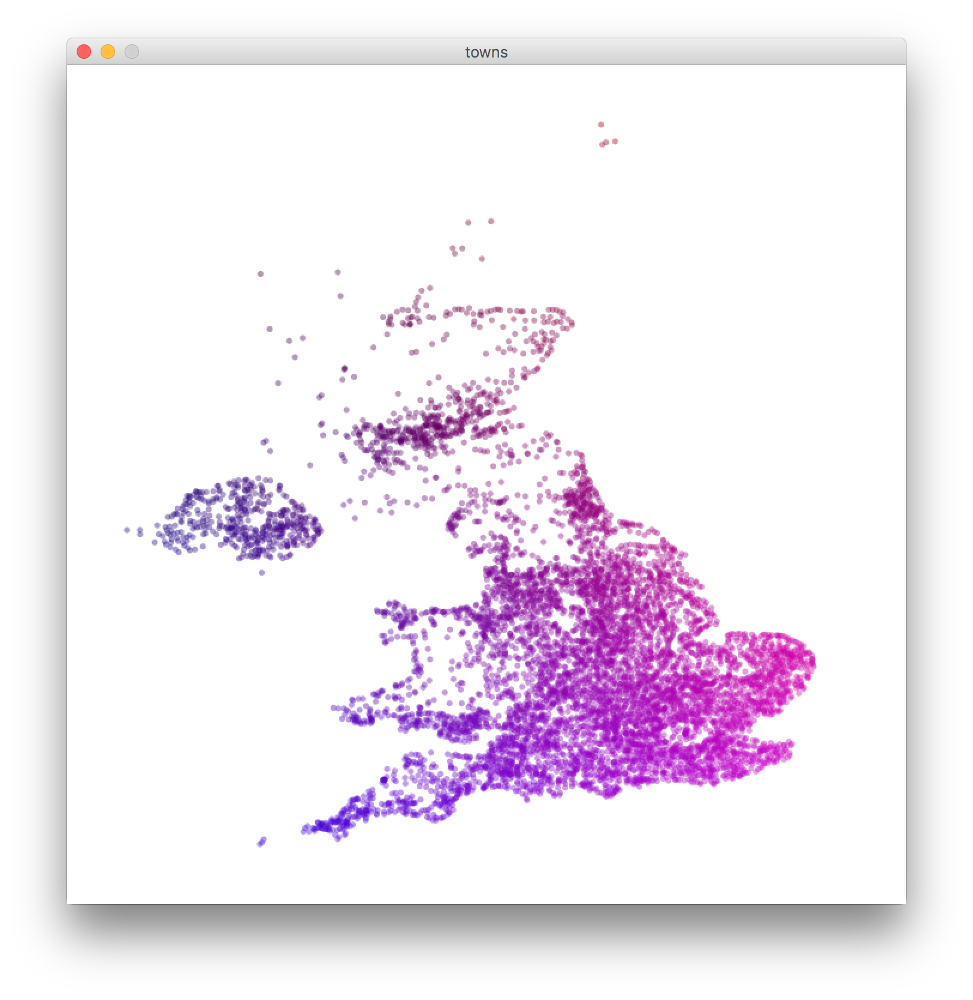

At every conference I’ve been to there has always been one person who’s core message is to make something every day. As somebody who’s in the creative industry, making things is not only my job — but my hobby.

The main problem I’ve found is that I don’t always want to make something using the same tools that I use day-in day-out. All of these shiny new tools and frameworks also take time to learn and setup — just to be able to spin up a simple side-project.

So unless I’m super motivated; then I find myself with an evening free and absolutely no will-power to do anything that requires coding. I just really don’t want to touch HTML or CSS.

After attending Reasons conference in Brighton, and WDC2016 in Bristol, a handful of people have highlighted a program called [Processing](http://processing.org/). Processing is a standalone program (with a [JavaScript](https://p5js.org/) port) that is super quick to just spring open and sketch through coding. The default language is Java, although that can be switched out to a number of alternatives if you’re not comfortable with it.

Truly though, Processing is *fast, *and it doesn’t matter how experienced you are as a developer. The more you use it: the more complex the programs you’ll be able to bring to life. Even as a beginner I’m able to draw things with code and solve problems in a neat little sandbox.

All of the code can then be saved or trashed with absolutely zero hassle. The entire environment is setup and working by just opening the program. It’s a lovely change to setting up a directory structure, followed by dealing with Atom/Chrome/NPM/Webpack for however long before I can get started.

The co-founder of Etsy, Jared Tarbell, uses Processing for generative art; which can be seen on his website [complexification](http://www.complexification.net/gallery/). All of his works come with their source-code if you wanted to try it yourself or explore what he’s done.

[Joshua Davis](https://vimeo.com/joshuadavis) uses Processing coupled with audio-input and Open Frameworks to create some awesome music videos.

[Ben Everard](https://github.com/beneverard/UK-Towns-Visualisation) is a Co-founder at [The Idea Bureau](http://theideabureau.co/) and he can be found using co-ordinates of towns to plot out a map of the UK to a stunning effect.

So if you find yourself with five minutes spare and not knowing what to do, why don’t you give Processing a try?
